# Self-Hosting API Analytics

API Analytics can be easily self-hosted, allowing for full control over your logged request data.

## Overview

```mermaid
graph TD
    %% --- Nodes ---
    %% Start Node (Hidden/Small circle to simulate 'just an arrow')
    Start(( ))

    subgraph "API Analytics"
        %% Gateway Layer
        nginx[<b>Nginx</b><br/>Reverse Proxy<br/>:80, :443]
        certbot[<b>Certbot</b><br/>SSL Certificates<br/>Let's Encrypt]

        %% Application Layer
        subgraph "Application Services"
            api[<b>API</b><br/>API key gen & data<br/>:3000]
            logger[<b>Logger</b><br/>Request logging<br/>:8000]
            monitor[<b>Monitor</b><br/>URL monitoring<br/>Every 30m]
        end

        %% Database Layer
        db[(<b>PostgreSQL</b><br/>Database<br/>:5432)]
    end

    %% --- Edges ---
    Start -->|HTTPS| nginx
    
    nginx -->|GET /api/data<br>GET /api/generate| api
    nginx -->|POST /api/requests| logger
    
    certbot -.->|Mounts certs| nginx

    api <-->|Read/write| db
    logger -->|Write logs| db
    monitor -->|Read/write status| db

    %% --- Styling ---
    classDef default fill:#ffffff,stroke:#333,stroke-width:1px,rx:5,ry:5;
    classDef cluster fill:#f8f9fa,stroke:#cbd5e0,stroke-width:2px,rx:10,ry:10;
    
    %% Specific Colors
    class Start inputNode;
    class nginx,certbot gateway;
    class api,logger,monitor app;
    class db database;

    %% Class Definitions
    classDef inputNode fill:#000,stroke:#000,width:15px,height:15px;
    classDef gateway fill:#e3f2fd,stroke:#1565c0,stroke-width:2px;
    classDef app fill:#f3e5f5,stroke:#7b1fa2,stroke-width:2px;
    classDef database fill:#e0f2f1,stroke:#00695c,stroke-width:2px;
```



Requirements:

- a publically addressable environment that can run Docker Compose, such as a VPS; and
- a domain name that is pointing to your server's IP address.

By default, the `docker-compose.yml` file is set up to generate a free SSL certificate for your domain using Certbot and Let's Encrypt.

You may need to adjust this configuration to work with your environment.

**Self-hosting is still undergoing testing, development and further improvements to make it as easy as possible to deploy. It is currently recommended that you avoid self-hosting for production use.**

## Backend Hosting

### Getting Started

#### 1. Clone the repo

```bash
git clone github.com/tom-draper/api-analytics
```

Open the `self-hosting` directory.

```bash
cd api-analytics/server/self-hosting
```

#### 2. Create a `.env` file

Create a new `.env` file, using the provided `.env.example` as a template.

**IMPORTANT:** All required environment variables must be set correctly:

- `DOMAIN_NAME`: Your domain (e.g., example.com) - **REQUIRED, must not be blank**
- `POSTGRES_DB`: Database name (default: analytics) - **REQUIRED**
- `POSTGRES_USERNAME`: Database user (default: postgres) - **REQUIRED**
- `POSTGRES_PASSWORD`: Database password - **REQUIRED, must not be blank**

**Warning:** Leaving any required environment variables blank will cause database initialization to fail with an invalid connection string.

#### 3. Obtain an SSL certificate using Certbot

Start the `certbot` and `nginx` services.

```bash
docker compose up certbot nginx -d
```

Generate the SSL certificate, replacing `your-domain.com` with your actual domain and `your-email@example.com` with your email address.

```bash
docker exec -it certbot certbot certonly --webroot -w /var/www/certbot -d your-domain.com -d www.your-domain.com --agree-tos --email your-email@example.com --no-eff-email
```

Stop the services once complete.

```bash
docker compose down
```

Within `docker-compose.yaml`, replace the temporary `nginx-certbot.conf.template` with the fully SSL-compatible `nginx.conf.template` under the `nginx` configuration. Comment the appropriate lines to match the following:

```yaml
# - ./nginx/nginx-certbot.conf.template:/etc/nginx/conf.d/nginx.conf.template
- ./nginx/nginx.conf.template:/etc/nginx/conf.d/nginx.conf.template
```

#### 4. Start the services

```bash
docker compose up -d
```

### Testing

#### Internal

Confirm all six Docker services are running internally.

```bash
docker ps
```

From the server, quickly check if internal services are working by attempting to generate a new API key.

```bash
curl -X GET http://localhost:3000/api/generate
```

For a more comprehensive test, confirm services are working internally by running the `tests/test-internal.sh` bash script.

```bash
chmod +x tests/test-internal.sh
./tests/test-internal.sh
```

#### Nginx

From the server, confirm Nginx is running and redirecting to the internal services correctly.

```bash
curl -kL -X GET http://localhost/api/generate
```

```bash
curl -k -X GET https://localhost/api/generate
```

For a more comprehensive test, confirm the Nginx service is working internally by running the `tests/test-nginx.sh` and  `tests/test-nginx-ssl.sh` bash scripts.

```bash
chmod +x tests/test-nginx.sh
./tests/test-nginx.sh

chmod +x tests/test-nginx-ssl.sh
./tests/test-nginx-ssl.sh
```

#### External

Outside of the hosting environment, confirm that services are publically accessible with an API key generation attempt.

```bash
curl -X GET http://<ip-address>:3000/api/generate
```

Confirm your domain is set up and that Nginx is redirecting correctly.

```bash
curl -X GET https://your-domain.com/api/generate
```

For a more comprehensive test, confirm the services are working externally by running the `tests/test-external.sh` bash script, providing your domain name.

```bash
chmod +x tests/test-external.sh
./tests/test-external.sh your-domain.com
```

Finally, confirm the dashboard can communicate with your server by attempting to generate an API key at: `https://www.apianalytics.dev/generate?source=https://your-domain.com`

You can check:
- Nginx logs with `docker logs nginx`
- API logs with `docker exec -it api tail api.log`

#### Maintenance

Check the status of the running services with:

```bash
docker ps
```

If needed, you can stop all services with:

```bash
docker compose stop
```

Remove all containers and images with:

```bash
docker compose down --rmi all
```

##### Database

The `database/schema.sql` schema is used to initialise the postgres database once the container is first built.

You can run custom SQL commands with:

```bash
docker exec -it db psql -U postgres -d analytics -c "YOUR SQL COMMAND;"
```

##### Updates

Updating the backend with the latest improvements is straight-forward, but will come with some downtime.

```bash
docker compose down
git pull origin main
docker compose up -d
```

##### IP Geolocation (Optional)

IP-to-location mappings are optional and provided by the GeoLite2 Country database maintained by MaxMind.

**To enable IP geolocation:**
1. Create a free account at `https://www.maxmind.com/en/home`
2. Download the `GeoLite2-Country.mmdb` file
3. Copy it to the `server/logger` folder before building

If you skip this step, the services will build and run successfully without any errors but IP location data will not be available in your analytics. The logger service will automatically detect whether the GeoLite2 database is present and adjust accordingly.

### Usage

#### Logging Requests

Once your backend services are running and tested, you can log requests to your server by specifying the server URL within the API Analytics middleware config.

```py
import uvicorn
from api_analytics.fastapi import Analytics, Config
from fastapi import FastAPI

app = FastAPI()
config = Config(server_url='https://your-domain.com')
app.add_middleware(Analytics, api_key=<api-key>, config=config)

@app.get("/")
async def root():
    return {"message": "Hello World!"}

if __name__ == "__main__":
    uvicorn.run("app:app", reload=True)
```

When debugging, checking the server logs is usually the best place to start.

```bash
docker logs nginx

docker exec -it logger tail requests.log

docker exec -it api tail api.log
```

#### Dashboard

You can use the dashboard by specifying the URL of your server as a `source` parameter when using `apianalytics.dev`, or you can access the raw data directly by making a GET request to your API data endpoint.

You can access your dashboard at: `https://www.apianalytics.dev/dashboard?source=https://www.your-domain.com`

You can access your raw data by sending a GET request to `https://www.your-domain.com/api/data`, with your API key set as `X-AUTH-TOKEN` in the headers.

## Frontend Hosting

Once up and running, self-hosted backend can be fully utilised and managed through `apianalytics.dev`. This ensures you always have the latest updates and improvements to the dashboard.

Whilst not recommeneded, it's possible to self-host the frontend dashboard by setting the URL of your backend service as a `SERVER_URL` environment variable, or manually changing the `SERVER_URL` held in `src/lib/consts.ts`. The frontend can then be deployed using your preferred hosting provider.

## Alternative with Traefik

### Development environment example

```bash
cd api-analytics/server/self-hosting
ln -s .env.dev .env
docker compose -f docker-compose.traefik-dev-example.yml up -d
```

* Traefik's dashboard page is served at http://localhost:8080
* Dev Dashbaord is served at http://localhost:5173
* Built Dashbaord is served at http://localhost/build
* API is served at http://localhost/api (GET). `curl -X GET http://localhost/api/health`
* Logger is served at http://localhost/api (POST) `curl -X POST http://localhost/api/requests`


### Production environment example

```bash
cd api-analytics/server/self-hosting
ln -s .env.prod .env
# IMPORTANT : set <DOMAIN_NAME> variable with your own domain into .env.prod
#             docker-compose.traefik-prod-example.yml have to be served onto <DOMAIN_NAME> server
docker compose -f docker-compose.traefik-prod-example.yml up -d
```

* https certificates are auto generated through letsencrypt ACME 👍️
* Dashbaord is served at https://example.com/api-analytics
* API is served at https://example.com/analytics-backend/api (GET). `curl -X GET https://example.com/analytics-backend/api/health`
* Logger is served at https://example.com/analytics-backend/api (POST) `curl -X POST https://example.com/analytics-backend/api/requests`

## Contributions

Feel free to customise this project to your preference. Any feedback or improvements that can still generalise to most deployment environments is much appreciated.

