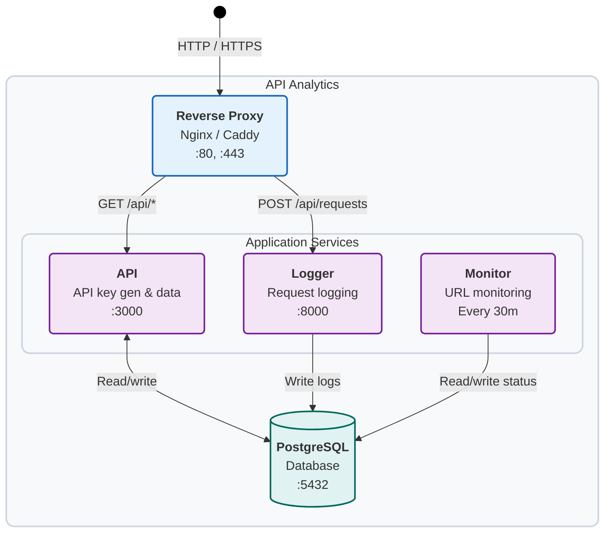

# Self-Hosting API Analytics

API Analytics can be easily self-hosted, allowing for full control over your logged request data.

## Overview


```mermaid
graph TD
    %% --- Nodes ---
    Start(( ))

    subgraph "API Analytics"
        %% Gateway Layer
        proxy[<b>Reverse Proxy</b><br/>Nginx / Caddy<br/>:80, :443]

        %% Application Layer
        subgraph "Application Services"
            api[<b>API</b><br/>API key gen & data<br/>:3000]
            logger[<b>Logger</b><br/>Request logging<br/>:8000]
            monitor[<b>Monitor</b><br/>URL monitoring<br/>Every 30m]
        end

        %% Database Layer
        db[(<b>PostgreSQL</b><br/>Database<br/>:5432)]
    end

    %% --- Edges ---
    Start -->|HTTP / HTTPS| proxy

    proxy -->|GET /api/*| api
    proxy -->|POST /api/requests| logger

    api <-->|Read/write| db
    logger -->|Write logs| db
    monitor -->|Read/write status| db

    %% --- Styling ---
    classDef default fill:#ffffff,stroke:#333,stroke-width:1px,rx:5,ry:5;
    classDef cluster fill:#f8f9fa,stroke:#cbd5e0,stroke-width:2px,rx:10,ry:10;

    classDef inputNode fill:#000,stroke:#000,width:15px,height:15px;
    classDef gateway fill:#e3f2fd,stroke:#1565c0,stroke-width:2px;
    classDef app fill:#f3e5f5,stroke:#7b1fa2,stroke-width:2px;
    classDef database fill:#e0f2f1,stroke:#00695c,stroke-width:2px;

    class Start inputNode;
    class proxy gateway;
    class api,logger,monitor app;
    class db database;
```

**Self-hosting is still undergoing testing and development. It is currently recommended that you avoid self-hosting for production use.**

## Getting Started

### 1. Clone the repo

```bash
git clone github.com/tom-draper/api-analytics
cd api-analytics/server/self-hosting
```

### 2. Create a `.env` file

Run the setup script to create a `.env` file with a randomly generated database password:

```bash
chmod +x setup.sh && ./setup.sh
```

Then open `.env` and fill in any remaining values. For SSL deployments you will also need to set `DOMAIN_NAME` and `ACME_EMAIL`.

### 3. Start the services

```bash
docker compose up -d
```

This starts all services with **nginx as a plain HTTP reverse proxy** on port 80. No domain name or SSL certificate is required, making it ideal for local testing and internal use.

### 4. Test the services

Confirm all services are running:

```bash
docker ps
```

Run the test scripts to verify everything is working:

```bash
chmod +x tests/test-internal.sh tests/test.sh

./tests/test-internal.sh   # tests API and logger directly (ports 3000, 8000)
./tests/test.sh            # tests via the nginx proxy (port 80)
```

---

## Production: Automatic HTTPS with Caddy

For a public-facing deployment, use the Caddy compose file. Caddy obtains and renews SSL certificates from Let's Encrypt automatically - no manual certificate setup required.

### 1. Point your domain at the server

Create an A record pointing your domain to your server's IP address.

### 2. Add to your `.env` file

```
DOMAIN_NAME=your-domain.com
ACME_EMAIL=your-email@example.com
```

### 3. Start with Caddy

```bash
docker compose -f docker-compose.caddy.yml up -d
```

Caddy will obtain the SSL certificate on first startup. Check progress with:

```bash
docker logs caddy
```

### 4. Test

```bash
chmod +x tests/test-internal.sh tests/test.sh

./tests/test-internal.sh                        # verify core services
./tests/test.sh https://your-domain.com         # verify proxy + SSL
```

Finally, confirm the dashboard can connect to your server:

`https://www.apianalytics.dev/generate?source=https://your-domain.com`

---

## Alternative: Nginx with SSL

If you prefer to manage SSL certificates yourself, `docker-compose.nginx.yml` uses nginx with Certbot for Let's Encrypt certificates.

### 1. Add to your `.env` file

```
DOMAIN_NAME=your-domain.com
```

### 2. Obtain an SSL certificate

Start nginx in HTTP-only mode for the ACME challenge (the compose file defaults to `nginx-certbot.conf` for this step):

```bash
docker compose -f docker-compose.nginx.yml up nginx certbot -d
```

Generate the certificate:

```bash
docker exec -it certbot certbot certonly --webroot -w /var/www/certbot \
  -d your-domain.com -d www.your-domain.com \
  --agree-tos --email your-email@example.com --no-eff-email
```

### 3. Switch to the SSL nginx config

In `docker-compose.nginx.yml`, swap the commented nginx volume lines so `nginx-ssl.conf` is active and `nginx-certbot.conf` is commented out, then restart:

```bash
docker compose -f docker-compose.nginx.yml down
docker compose -f docker-compose.nginx.yml up -d
```

---

## Maintenance

Check service status:

```bash
docker ps
```

View logs:

```bash
docker logs nginx        # or: docker logs caddy
docker logs api-analytics-api
docker logs api-analytics-logger
```

Stop all services:

```bash
docker compose stop
```

Remove all containers and images:

```bash
docker compose down --rmi all
```

### Updates

```bash
docker compose down
git pull origin main
docker compose up -d
```

### Database

The `database/schema.sql` schema is used to initialise the postgres database on first run.

Run custom SQL commands:

```bash
docker exec -it db psql -U postgres -d analytics -c "YOUR SQL COMMAND;"
```

### IP Geolocation (Optional)

IP-to-location mappings are provided by the GeoLite2 Country database maintained by MaxMind.

To enable:
1. Create a free account at `https://www.maxmind.com/en/home`
2. Download `GeoLite2-Country.mmdb`
3. Copy it to the `server/logger` folder before building

If skipped, the services will run without errors but location data will not be available.

---

## Usage

### Logging Requests

Once running, point the API Analytics middleware at your server:

```py
import uvicorn
from api_analytics.fastapi import Analytics, Config
from fastapi import FastAPI

app = FastAPI()
config = Config(server_url='https://your-domain.com')
app.add_middleware(Analytics, api_key=<api-key>, config=config)

@app.get("/")
async def root():
    return {"message": "Hello World!"}

if __name__ == "__main__":
    uvicorn.run("app:app", reload=True)
```

### Dashboard

Access your dashboard at:
`https://www.apianalytics.dev/dashboard?source=https://your-domain.com`

Access raw data:
```bash
curl -H "X-AUTH-TOKEN: <api-key>" https://your-domain.com/api/data
```

---

## Frontend Hosting

The self-hosted backend works with `apianalytics.dev` out of the box. If you want to self-host the frontend too, set `SERVER_URL` to your backend URL as an environment variable, or update `SERVER_URL` in `src/lib/consts.ts`, then deploy using your preferred hosting provider.

---

## Alternative: Traefik

If you prefer Traefik as your reverse proxy, `docker-compose.traefik.yml` provides the same automatic HTTPS experience as the Caddy option.

### 1. Add to your `.env` file

```
DOMAIN_NAME=your-domain.com
ACME_EMAIL=your-email@example.com
```

### 2. Start with Traefik

```bash
docker compose -f docker-compose.traefik.yml up -d
```

Traefik will obtain the SSL certificate on first startup via Let's Encrypt. No separate config file is required.

---

## Contributions

Feel free to customise this project to your preference. Any feedback or improvements that can still generalise to most deployment environments is much appreciated.
